# Wagering

Serviço de processamento distribuído de operações financeiras de apostas, com API HTTP, consumidor SQS, PostgreSQL e autenticação OIDC. Implementado em Go com Uber Fx, a partir do [DESAFIO.md](DESAFIO.md).

As operações externas são `BET`, `WIN`, `LOSS`, `REFUND` e `ROLLBACK`. A implementação inclui ledger, reconciliação, idempotência persistente, inbox e outbox. HTTP e SQS compartilham o caso de uso financeiro.

Este README reúne as instruções de execução exigidas pela seção 15 do desafio. A [documentação disponível](#documentação-disponível) detalha contratos, regras, decisões e evidências de execução.

## Instalação em um comando

Em um terminal Bash no macOS, Ubuntu 22.04+ ou Debian 12+, execute:

```bash
curl --fail --silent --show-error --location \
  https://raw.githubusercontent.com/JimSP/wagering/feature/ledger/scripts/install.sh | bash
```

O instalador verifica ferramentas e versões, clona `feature/ledger` em `./wagering`, baixa as dependências e imagens, gera o `.env`, compila a aplicação e sobe a stack. O provisionamento cria as filas e identidades e aplica as migrations automaticamente. O comando só termina com sucesso quando os serviços estão prontos.

Para escolher o diretório ou preparar o ambiente sem iniciá-lo:

```bash
curl --fail --silent --show-error --location \
  https://raw.githubusercontent.com/JimSP/wagering/feature/ledger/scripts/install.sh \
  | bash -s -- --dir ./meu-wagering --no-start
```

O instalador não sobrescreve um diretório existente. Dentro de um checkout já existente, execute `bash scripts/setup.sh`; o `.env` existente será preservado. Dependências ausentes ou incompatíveis são apresentadas com a versão detectada, a mínima necessária e a alteração proposta. **Cada instalação ou atualização exige digitar `SIM` no terminal.** Enter, qualquer outra resposta ou ausência de terminal interrompem a operação; conteúdo enviado pelo pipe não autoriza alterações. Versões compatíveis são preservadas.

### Decisões Técnicas

**Critério da escolha: explicar e controlar o caminho do dinheiro.** Registrar que uma carteira perdeu 25.00 permite reconstruir seu saldo, mas não explica, sozinho, onde esses recursos ficaram, a qual aposta estão vinculados e quais operações podem consumi-los ou devolvê-los. Escolhemos representar essas relações explicitamente para que controladoria, auditoria e reconciliação possam acompanhar o movimento completo.

Por isso, cada movimento interno usa **partidas dobradas**: um débito na origem e um crédito de mesmo valor e moeda no destino, confirmados na mesma transação. A decisão segue uma prática contábil consolidada de controladoria e auditoria. O benefício buscado é aderência a esse padrão da indústria financeira, com contrapartidas verificáveis e histórico rastreável. Aceitamos, em troca, mais registros, mais invariantes no banco e maior complexidade nos fluxos de liquidação e estorno.

O [DESAFIO.md](DESAFIO.md#64-walletledgerentry) exige um ledger imutável por carteira e declara partidas dobradas como opcionais. Adotamos esse diferencial e ampliamos o domínio com contas de **garantia** (saldo disponível), contas **operacionais** (recursos comprometidos), compromissos por aposta e liquidação. Essas regras de financiamento e de ciclo da aposta são decisões adicionais do projeto; não são exigências inerentes às partidas dobradas.

#### Por que adotamos cada decisão

| Decisão | Problema que resolve e vantagem | Trade-off assumido |
| --- | --- | --- |
| **Parear as partidas e confirmar os efeitos no mesmo commit** | Torna explícita a contrapartida de cada transferência interna. As proteções no PostgreSQL impedem confirmar apenas um dos lados, mantendo contas, lançamentos e eventos coerentes mesmo com várias instâncias. | Cada movimento grava mais dados e valida mais relações. Transações envolvendo várias contas exigem ordenação de locks e tratamento de conflitos; a integridade depende também das constraints e funções SQL mantidas nas migrations. |
| **Separar garantia, operacional e compromisso por aposta** | Distingue o dinheiro disponível do dinheiro já comprometido. O vínculo por aposta permite conferir qual aporte financia cada pagamento e evita usar recursos de outra aposta como se estivessem livres. | A carteira passa a ter duas contas e um controle adicional de compromissos. Conferir apenas o saldo público deixa de ser suficiente para auditar toda a operação; é necessário conferir também contas operacionais, consumos e liquidações. |
| **Exigir financiamento elegível para WIN** | Faz o crédito ter uma origem identificável no modelo implementado. No caminho individual, o pagamento consome o compromisso da BET resolvida; na liquidação compartilhada, segue o plano de distribuição persistido. | Restringe o contrato: uma WIN individual sem BET elegível ou acima do compromisso restante é rejeitada. Prêmios que excedam esse financiamento exigiriam outra origem de recursos explicitamente modelada; o valor informado pelo provedor, sozinho, não autoriza o crédito. |
| **Persistir uma janela para BET, REFUND e WIN** | Define o limite entre admissão/devolução de aportes e pagamento de resultados. O prazo persistido fornece uma referência comum para requisições concorrentes e para retomadas após reinício. | O integrador precisa respeitar o tempo da aposta: REFUND após o prazo e WIN antecipada são rejeitados. A configuração global simplifica a operação, mas não permite escolher uma janela diferente por jogo ou provedor. |
| **Persistir o plano de liquidação e executá-lo pela fila privada** | Separa a confirmação do resultado da execução financeira. A outbox conserva a intenção de executar; outro processo pode retomar o plano após falha, usando os mesmos valores e vínculos já registrados. | Confirmar o resultado não significa que o pagamento terminou. Há estados intermediários, atraso de fila e necessidade de acompanhar backlog, retries e DLQ; clientes precisam consultar o estado da liquidação. |
| **Estornar com lançamentos compensatórios vinculados aos originais** | Preserva a trilha de auditoria: é possível identificar o movimento original, sua compensação e os efeitos sobre compromissos e pagamentos dependentes. Permite desfazer efeitos após liquidação sem apagar a história. | Estornar pode envolver várias contas e operações, com mais locks e verificações. O fluxo precisa resolver dependências e liquidez antes de confirmar a compensação integral. |
| **Manter ROLLBACK pendente quando ainda há recursos a aguardar** | Conserva uma solicitação de estorno que ainda pode ser atendida. A recuperação de BETs abertas elegíveis e a retomada durável permitem concluir a reversão quando houver recursos, sem gerar saldo negativo ou estorno parcial. | A conclusão pode ficar sem prazo definido. É necessário monitorar `PENDING_ROLLBACK` e explicar esse estado ao cliente; a recuperação também pode compensar outras BETs elegíveis da carteira. Insuficiência definitiva continua sendo rejeitada. |

**Exemplo do ganho e do custo:** com 100.00 disponíveis, uma BET de 25.00 deixa 75.00 na garantia e 25.00 na operacional, vinculados àquela aposta. Após o prazo, uma WIN individual de 10.00 devolve esse valor à garantia: ficam 85.00 disponíveis e 15.00 no compromisso. O ganho é conseguir explicar e conferir cada parcela. O custo é que uma WIN individual de 30.00 nesse cenário não pode ser tratada como um crédito livre: falta financiamento elegível no modelo escolhido.

#### O que mudou em relação ao desafio

| Aspecto | Pedido no desafio | Decisão implementada e impacto |
| --- | --- | --- |
| `BET` e ledger | Debitar a carteira e registrar um lançamento. | Transferir da garantia para a operacional e registrar o compromisso da aposta. Uma BET de 25.00 sobre 100.00 deixa 75.00 disponíveis e 25.00 comprometidos, com duas partidas físicas. O extrato público continua mostrando um único débito de 25.00. |
| `WIN` | Creditar um valor positivo, com referência opcional a uma BET. | Exigir uma BET elegível e recursos comprometidos suficientes no caminho individual; sem referência explícita, selecionar a mais antiga elegível no mesmo contexto. O crédito retorna recursos da operacional à garantia. Isso restringe os créditos admitidos em relação ao enunciado. |
| Janela da aposta e `REFUND` | Devolver integralmente uma BET processada, respeitando as regras de referência e reversão. | Admitir REFUND antes do prazo de fechamento e WIN a partir desse prazo, conforme a política `BET_WINDOW`. A janela é uma regra de negócio adicional ao texto original. |
| `ROLLBACK` | Inverter integralmente BET, WIN ou REFUND; rejeitar se o débito da reversão exceder o saldo disponível. | Criar partidas compensatórias vinculadas às originais, inclusive para dependências de liquidação. Na falta de saldo, o fluxo pode recuperar recursos de BETs abertas ou aguardar resultados em `PENDING_ROLLBACK`, ampliando o comportamento pedido. |
| Saldo e reconciliação | Reconstruir o saldo da carteira pelo ledger. | Expor e reconciliar o saldo da garantia. A conferência das contas operacionais, compromissos e liquidações exige a auditoria contábil complementar. |

**Limite do modelo:** os movimentos internos têm duas partidas, mas `OPENING` representa uma entrada externa e registra apenas o crédito na garantia; saldo inicial zero não gera lançamento. `LOSS` e rejeições também não geram partidas. Portanto, o pareamento é uma garantia dos movimentos internos, não de todas as entradas do sistema.

Para a avaliação, essa escolha deve ser lida como uma extensão deliberada do modelo financeiro, com diferenças observáveis no contrato, e não como atendimento literal de todas as regras originais. A [comparação entre desafio e implementação](docs/DESAFIO_VS_CODIGO.md) detalha as diferenças por operação; o [modelo de dados](docs/database/README.md) descreve as contas, os diários e as proteções no PostgreSQL.

### Dependências e autorizações

| Dependência | Critério verificado |
| --- | --- |
| Git | Versão 2.23 ou superior |
| Go | Versão estável igual ou superior à declarada em `go.mod` (atualmente 1.27.1) |
| Docker CLI e daemon | Versão 24 ou superior e acesso ao daemon |
| Docker Compose | Plugin versão 2.20 ou superior |
| curl / jq | Versões 7.68 / 1.6 ou superiores |
| Make | Versão 3.81 ou superior, para os atalhos de comandos |
| Compilador C | `cc` versão 10 ou superior, para testes com race detector |
| uuidgen | Presença e geração de um UUID válido; não possui versão portátil comum aos sistemas suportados |

No macOS, o instalador usa [Homebrew](https://brew.sh/) e solicita autorização separada se precisar instalar o próprio gerenciador ou as Command Line Tools da Apple. Docker e Compose são fornecidos pelo [Docker Desktop](https://docs.docker.com/desktop/setup/install/mac-install/). No Ubuntu 22.04+/Debian 12+, usa APT e o [repositório oficial do Docker](https://docs.docker.com/engine/install/ubuntu/); alterações administrativas podem solicitar `sudo`.

Quando o Go precisa ser instalado, o arquivo é obtido de [go.dev](https://go.dev/doc/install), conferido com o SHA-256 publicado e instalado em `~/.local/share/wagering/toolchains/`. O Go do sistema e os perfis de shell são preservados; os scripts do projeto ativam o toolchain privado quando necessário.

Iniciar o Docker também exige confirmação se o daemon estiver parado. Uma atualização do Docker pode interromper containers existentes; esse impacto aparece na solicitação. O instalador não remove pacotes conflitantes nem altera grupos/permissões do socket automaticamente. Acesso ao Docker e instalação gráfica das ferramentas do macOS precisam ser concluídos quando o sistema operacional solicitar.

Para verificar tudo sem instalar, atualizar, clonar ou iniciar serviços:

```bash
bash scripts/setup.sh --check
```

Antes de ter o checkout, a mesma verificação está disponível com `curl` na URL de instalação e `bash -s -- --check`. Para executar o comando remoto inicial, `curl` e Bash precisam estar disponíveis; também é possível baixar `scripts/install.sh` pelo navegador e executá-lo com Bash.

## Uso diário

Execute os scripts a partir do diretório do projeto:

| Ação | Comando |
| --- | --- |
| Preparar e iniciar o ambiente | `bash scripts/setup.sh` |
| Verificar dependências sem alterar o ambiente | `bash scripts/setup.sh --check` |
| Preparar sem iniciar | `bash scripts/setup.sh --no-start` |
| Subir e aguardar prontidão | `bash scripts/up.sh` |
| Baixar o ambiente, preservando os dados | `bash scripts/down.sh` |
| Acompanhar logs | `docker compose logs -f app` |
| Iniciar três réplicas com gateway e healthchecks | `bash scripts/up.sh --replicas 3` |
| Demonstrar os fluxos e gerar comparação | `bash scripts/demo.sh` |
| Acessar SQS com IAM provisionado | `bash scripts/sqs.sh --help` |
| Consultar os tipos de teste | `bash scripts/test.sh --help` |

O gateway publica a API em `http://localhost:8080`; as réplicas não publicam portas no host. O Keycloak fica em `http://localhost:8081`. As portas locais `8080`, `8081`, `5432` e `4566` precisam estar disponíveis. Os scripts usam Bash e podem ser chamados por caminho absoluto a partir de outro diretório.

As versões e imagens da infraestrutura estão fixadas no [docker-compose.yml](docker-compose.yml): PostgreSQL 16.4, Keycloak 26.0, MiniStack 1.5.17 e golang-migrate 4.17.1. O gateway usa HAProxy 3.2.25, fixado no Dockerfile. Go está declarado em [go.mod](go.mod) e no [Dockerfile](Dockerfile).

O demo usa Go e Docker Compose; a AWS CLI é executada dentro do MiniStack pelo wrapper IAM, sem instalação no host. Testes com `-race` precisam de um compilador C e `CGO_ENABLED=1`. Os relatórios de cobertura, mutação e aceite são gerados por ferramentas Go; `test.sh` verifica as dependências necessárias ao tipo solicitado. Make é opcional para os atalhos de migrations.

## Qualidade

Prepare as ferramentas com `bash bootstrap-go-stack.sh`. Elas têm versões fixas, instalação isolada e consentimento explícito. Execute `bash scripts/check.sh full` para as verificações de desenvolvimento e `bash scripts/check.sh release` para incluir a campanha completa de mutação. Hooks são opcionais e ativados separadamente. Veja o [guia de qualidade](docs/guias/qualidade.md) para escopo, evidências e CI.

Para executar **somente a mutação**, sem chamar o gate geral:

```bash
bash scripts/test-mutations.sh
```

A campanha é incremental por padrão, inclusive no modo `release`: reutiliza evidências válidas dos pacotes cujas entradas e ferramentas não mudaram e reexecuta os demais. O cache fica em `.local/mutation-cache`; cada campanha grava um novo relatório em `.local/mutation-campaign.*`. Preserve também as evidências originais usadas pelo cache.

- `bash scripts/test-mutations.sh --package internal/app/usecase`: campanha parcial de um pacote; não comprova aprovação global.
- `bash scripts/test-mutations.sh --refresh`: reexecuta todos os pacotes, sem reutilizar resultados anteriores.

A última campanha concluída registrou **2.067 mutantes, 100% de cobertura e eficácia de mutação, zero sobreviventes e zero timeouts**: 1.725 foram detectados por testes e 342 rejeitados na compilação. Esses percentuais são de mutação, não de cobertura de statements. Veja [resultados, evidências locais e limites de validade](VERIFICATION.md#mutação-incremental--01102026). O gate geral não foi reexecutado junto dessa campanha.

## OpenTelemetry e visualização local

Tracing opcional está implementado para HTTP, PostgreSQL, SQS, outbox e retomada de referências. Os logs JSON preservam `correlationId` e acrescentam `trace_id`/`span_id` quando possuem contexto de trace. As oito categorias de métricas obrigatórias continuam no registry Prometheus existente.

Com `.env` preparado, habilite a exportação e o perfil de observabilidade:

```bash
OTEL_SDK_DISABLED=false docker compose --profile observability up --build -d
```

O comando inicia a stack, aplica as migrations pendentes e acrescenta Jaeger 2.21.0 (collector e interface de traces) e Prometheus 3.13.3. Para manter a configuração em próximas execuções, defina `OTEL_SDK_DISABLED=false` e `COMPOSE_PROFILES=observability` no `.env`. A indisponibilidade do Jaeger não é requisito de readiness da aplicação.

| Acesso | Finalidade |
| --- | --- |
| `http://localhost:16686` | Jaeger: selecione o serviço `wagering` e consulte os traces |
| `http://localhost:9090` | Prometheus: consulte as métricas e a página de targets |
| `http://localhost:8080/metrics` | Exposição direta das métricas da instância API |
| `http://localhost:4318/v1/traces` | Recepção OTLP/HTTP pelo Jaeger para aplicações executadas no host |

`bash scripts/demo.sh` demonstra cenários financeiros reais, registra os resultados e pode ser usado para observar traces. Prometheus consulta cada réplica de `app` pela porta interna 9090. Serviços de workers separados precisam de `METRICS_ADDR` e de um target próprio em `deploy/observability/prometheus.yaml`. A porta de métricas dedicada não é publicada no host pelo Compose. `/metrics` pelo gateway mostra apenas a réplica que respondeu; use Prometheus para agregar todas.

Jaeger usa memória limitada a 10.000 traces e perde seu histórico ao reiniciar. Prometheus conserva até sete dias no volume `prometheusdata`. Não há dashboards Grafana ou ensaio de carga nesta entrega. [Configuração, consultas das oito métricas e limites](docs/OBSERVABILITY.md#opentelemetry).

**Estado de validação desta alteração:** compilação da aplicação, revisão estática e configuração Compose; sem testes novos, execução de testes, cobertura, gate de qualidade ou campanha de mutação. A stack de tracing não foi iniciada nesta implementação. Posteriormente, a migration 000014 foi aplicada no banco local com autorização expressa, confirmando versão 14 sem dirty; os resultados históricos abaixo não validam esta alteração.

## Configuração do ambiente

O setup chama o gerador Go em [cmd/init-env](cmd/init-env/), que lê [.env.example](.env.example), cria `.env` com permissão `0600` e credenciais aleatórias, e recusa sobrescrever um arquivo existente. Não é necessário preencher ou copiar os secrets manualmente. `.env` e `.local/` são ignorados pelo Git.

| Variável | Uso no ambiente local |
| --- | --- |
| `POSTGRES_PASSWORD` | Senha administrativa, usada pelo provisionamento e migrador |
| `POSTGRES_APP_PASSWORD` | Senha do usuário restrito `wagering_app` |
| `DATABASE_URL` | Conexão da aplicação; o gerador prepara o endereço do host e o Compose substitui pelo endereço interno |
| `KC_BOOTSTRAP_ADMIN_PASSWORD` | Senha do administrador local `admin` do Keycloak |
| `TEST_PROVIDER_A_CLIENT_SECRET`, `TEST_PROVIDER_B_CLIENT_SECRET`, `TEST_INTERNAL_CLIENT_SECRET`, `TEST_EXPIRED_CLIENT_SECRET` | Secrets dos clientes provisionados no Keycloak |
| `TEST_PROVIDER_A_CLIENT_ID`, `TEST_PROVIDER_B_CLIENT_ID`, `TEST_INTERNAL_CLIENT_ID` | Identificadores dos clientes usados nos exemplos e testes |
| `OIDC_ISSUER`, `OIDC_JWKS_URL`, `OIDC_AUDIENCE` | Emissor, endereço das chaves públicas e audiência dos tokens; audiência local `wagering-api` |
| `AWS_REGION`, `AWS_ENDPOINT_URL` | Região `us-east-1` e endereço do MiniStack |
| `AWS_PROFILE`, `AWS_SHARED_CREDENTIALS_FILE` | Perfil IAM `worker` e arquivo de credenciais gerado pelo emulador |
| `WAGER_QUEUE_URL`, `WAGER_DLQ_URL` | Fila de operações externas e sua DLQ |
| `SETTLEMENT_QUEUE_URL`, `EVENTS_QUEUE_URL` | Fila de liquidação interna e destino dos eventos da outbox |
| `ROLES` | Componentes ativos: `api,sqs-consumer,outbox-publisher,reference-worker` no exemplo |
| `HTTP_ADDR` | Endereço de escuta da API; `:8080` |
| `BET_WINDOW` | Janela global das apostas; `5m`, com duração positiva em segundos inteiros |
| `SHUTDOWN_TIMEOUT` | Prazo de encerramento; `25s`, aceitando de `8s` a `25s` |
| `LOG_LEVEL` | Nível dos logs; `info` |
| `OTEL_SDK_DISABLED` | `true` por padrão; `false` habilita tracing |
| `OTEL_SERVICE_NAME` | Nome do serviço nos traces; `wagering` |
| `OTEL_EXPORTER_OTLP_TRACES_ENDPOINT` | URL completa OTLP/HTTP, incluindo `/v1/traces`; Compose aponta para Jaeger |
| `OTEL_TRACES_SAMPLER_ARG` | Probabilidade de amostragem de traces novos entre 0 e 1; padrão 1, respeitando a decisão do pai |
| `METRICS_ADDR` | Listener dedicado de métricas por processo; vazio no host, `:9090` no Compose |

O Compose carrega `.env` e sobrescreve os endereços necessários à rede dos containers. Mudar uma senha em `.env` não altera automaticamente a senha de um PostgreSQL já inicializado: a troca exige rotação da credencial no serviço.

## Provisionamento automático

`setup.sh` e `up.sh` usam Docker Compose para iniciar as dependências, aguardar seus health checks, aplicar as migrations e iniciar a aplicação. `up.sh` também gera `.env` quando ausente. O comando equivalente de execução direta é `docker compose up --build` após preparar a configuração.

### Filas e permissões

O serviço chamado `localstack` executa **MiniStack**, com IAM ativo. O [script de inicialização](deploy/localstack/init/01-queues.sh) provisiona automaticamente:

| Fila | Finalidade |
| --- | --- |
| `wager-transactions.fifo` | Entrada das operações externas |
| `wager-transactions-dlq.fifo` | Mensagens da entrada que esgotaram o redrive |
| `wager-settlements.fifo` | Processamento da liquidação interna |
| `wager-settlements-dlq.fifo` | DLQ da liquidação |
| `wager-events.fifo` | Eventos de saída publicados pela outbox |

O script também cria os perfis `worker`, `ingress`, `auditor` e `denied`, com políticas distintas. Use `bash scripts/sqs.sh ingress ...` para publicar e `bash scripts/sqs.sh auditor ...` para consumir eventos ou consultar a DLQ, sem copiar secrets. [Comandos completos de envio e consumo](docs/EVALUATOR.md#acesso-sqs-sem-copiar-credenciais). As credenciais ficam no volume `awscredentials`. O bootstrap `test/test` é uma convenção do emulador, não uma credencial AWS real. Provedores externos não recebem o perfil `ingress`: a publicação por esse perfil pressupõe um serviço interno que valide a identidade do provedor.

### IdP e identidades locais

O Keycloak importa automaticamente o [realm](deploy/keycloak/realm-export.json), usando os secrets de `.env`:

| Cliente | Identidade e finalidade |
| --- | --- |
| `provider-a` | Operações do provedor `provider-a` |
| `provider-b` | Operações do provedor `provider-b`; testes de isolamento |
| `internal-service` | Operações internas, incluindo abertura e consulta de carteiras |
| `expired` | Testes com token de duração de um segundo |

O fluxo é OAuth 2.0 `client_credentials`. O emissor local é `http://localhost:8081/realms/wagering`; o Compose configura a busca de JWKS pela rede interna dos containers.

### Saúde e encerramento

`up.sh` aguarda os health checks de cada réplica e do gateway no Compose. O probe compilado `/healthcheck` consulta `/health/ready` com timeout, inclusive na imagem distroless. O gateway verifica a saúde dos backends e acompanha alterações de escala pelo DNS do Docker. A API expõe `GET /health/live`, `GET /health/ready` e `GET /metrics`. Liveness verifica o processo; readiness consulta PostgreSQL e SQS de entrada. Os endpoints são públicos no servidor atual, com portas publicadas somente em `127.0.0.1`. Os logs são JSON.

`down.sh` encerra os serviços sem remover os volumes do PostgreSQL, broker e credenciais. A próxima execução de `up.sh` reutiliza esses dados.

## Migrations

O gerenciador [cmd/schema](cmd/schema/) é escrito em Go e executa o golang-migrate fixado no Compose. O fluxo de migrations e os testes de schema e integração não dependem de Python.

As migrations versionadas em [migrations/](migrations/) têm pares `up`/`down` e checksums. A inicialização pelo Compose aplica as versões pendentes; os comandos abaixo permitem controlar a execução separadamente:

```bash
docker compose up -d --wait postgres
make schema-check
make migrate-up
make schema-status
```

Para reverter uma versão, pare a aplicação e os workers que usam esse banco, execute a reversão e reaplique quando necessário:

```bash
docker compose stop app
make migrate-down STEPS=1
make migrate-up
docker compose up -d app
```

Para criar uma versão, use `make schema-new NAME=nome_da_alteracao`; implemente e teste os dois arquivos SQL, depois registre seus hashes com `make schema-seal`. `make schema-dump` emite o schema SQL na saída padrão. Os atalhos chamam `go run ./cmd/schema` a partir da raiz do checkout.

Reversões de schema podem remover estruturas e dados; consulte o arquivo `down` correspondente antes de executá-las. Elas não são o `ROLLBACK` financeiro. Migrations já registradas não devem ser editadas: evolua o schema com uma nova versão. Consulte os detalhes no [modelo de dados e gestão de migrations](docs/database/README.md).

## Nosso roteiro demonstrativo

```bash
bash scripts/up.sh --replicas 3
DEMO_MIN_REPLICAS=3 bash scripts/demo.sh
```

O avaliador pode comparar este roteiro com os scripts próprios dele. O demo demonstra os fluxos e regras da implementação, registra entradas e respostas e explica diferenças em relação ao `DESAFIO.md`. Não substitui a avaliação dele nem executa suítes de teste, gates, cobertura ou mutação.

A execução cria dados sintéticos na stack local e gera `.local/demo.XXXXXX/demonstration.json` e `comparison.md`: operações HTTP/SQS, resultados, estados, eventos, saldos e notas comparativas. Inclui os cinco tipos de operação, WIN válida após a janela, reversões, autenticação, replay, concorrência, referências, ledger, reconciliação e DLQ. O roteiro aguarda a janela real, padrão cinco minutos, para demonstrar as etapas posteriores.

`PASS` significa que o observado corresponde ao comportamento documentado do projeto; não significa conformidade integral com o desafio. Diferenças conhecidas ficam explícitas no relatório. Uma resposta inesperada ou etapa bloqueada é registrada e produz saída não zero.

O Compose aceita `docker compose up --build -d --scale app=3 --wait` com `.env` preparado. O gateway mantém a porta 8080 e cada réplica possui healthcheck, sem disputa de portas. Há suporte a até 32 réplicas. O demo padrão aceita uma; `DEMO_MIN_REPLICAS=3` exige demonstrar distribuição em três.

[Procedimento e comparação](docs/EVALUATOR.md), [contratos implementados](docs/CONTRACTS.md) e [OpenAPI](api/openapi.yaml). Em 01/10/2026, o roteiro foi executado em uma exportação limpa dos fontes, com banco novo e três réplicas: **28 cenários PASS**, sem falhas ou bloqueios. [Procedimento, hashes e evidências](docs/verification/clean-start-2026-10-01/README.md).

## Testes

Um único script seleciona a suíte e prepara as imagens necessárias. Os códigos de saída das verificações são propagados: uma falha não é apresentada como sucesso.

| Tipo | Comando | Escopo |
| --- | --- | --- |
| Unitários | `bash scripts/test.sh unit` | `go test ./...`, sem a tag de integração |
| Race detector | `bash scripts/test.sh race` | `go test -race ./...` |
| Análise estática | `bash scripts/test.sh vet` | `go vet ./...` |
| Cobertura | `bash scripts/test.sh coverage` | Domínio, casos de uso e autenticação; relatório em `.local/coverage` |
| PostgreSQL | `bash scripts/test.sh postgres` | Banco real descartável, constraints e atomicidade |
| Integração | `bash scripts/test.sh integration` | Suíte PostgreSQL e sistema com PostgreSQL, Keycloak e MiniStack reais |
| Migrations | `bash scripts/test.sh schema` | Aplicação, reversão, reaplicação e equivalência do schema |
| Concorrência | `bash scripts/test.sh concurrency` | Disputa financeira e duplicidade em três processos independentes |
| Recuperação | `bash scripts/test.sh recovery` | Interrupções, reentrega, outbox, pendências, indisponibilidade e shutdown |
| Mutação | `bash scripts/test.sh mutations` | Executa campanha incremental com Gremlins 0.6.0 previamente instalado pelo bootstrap |
| Fuzzing | `bash scripts/test.sh fuzz` | Aritmética monetária comparada com inteiros de precisão arbitrária, por 30 segundos |
| Aceitação | `bash scripts/test.sh acceptance` | Matriz de aceitação e relatórios em `docs/acceptance/evidence` |
| Sequência principal | `bash scripts/test.sh all` | Unitários, race, vet, migrations, PostgreSQL e integração; campanhas de mutação, fuzzing, cobertura e aceitação têm comandos próprios |

Os tipos baseados em `go test` permitem argumentos adicionais, por exemplo `bash scripts/test.sh unit -run TestNome`. `integration`, `concurrency` e `recovery` executam com `-race -tags 'integration faults'`; a suíte PostgreSQL usa `-race -tags integration`. O build normal da aplicação não habilita a tag `faults`.

As suítes de integração criam credenciais, containers e portas próprios e removem sua infraestrutura ao terminar. Não usam a base manual. A suíte de sistema inicia três processos independentes da aplicação; não é necessário escalar o serviço `app` manualmente. Os cenários e evidências estão em [VERIFICATION.md](VERIFICATION.md) e no [relatório de integração](docs/verification/integration-complete-2026-09-29/README.md).

## Documentação disponível

| Documento | Conteúdo |
| --- | --- |
| [Arquitetura](ARCHITECTURE.md) | Dinheiro, transações, locks, idempotência, segurança, Fx e shutdown |
| [Contratos](docs/CONTRACTS.md) e [OpenAPI](api/openapi.yaml) | HTTP, eventos, regras financeiras, estados, erros e exemplos |
| [Desafio versus implementação](docs/DESAFIO_VS_CODIGO.md) | Requisitos originais, decisões e diferenças observáveis |
| [Banco e migrations](docs/database/README.md) | Contas, ledger, compromissos, liquidação, invariantes SQL e evolução do schema |
| [Roteiro do avaliador](docs/EVALUATOR.md) | Execução, três réplicas, IAM e demonstração HTTP/SQS |
| [Observabilidade](docs/OBSERVABILITY.md) | Logs, métricas, health, tracing e configuração de Jaeger/Prometheus |
| [Qualidade](docs/guias/qualidade.md) | Gates, ferramentas, cobertura, mutação e CI |
| [Verificação](VERIFICATION.md) | Resultados datados, comandos, evidências e escopo validado |
| [Índice da documentação](docs/README.md) | Navegação e distinção entre documentação vigente e registros históricos |

Os comandos de testes estão na seção [Testes](#testes). Testes de carga e dashboards Grafana são diferenciais opcionais ainda não entregues.

## Processo de qualidade e resultados

O processo combina revisão das regras financeiras, verificações estáticas, testes de comportamento, integração com serviços reais e mutação. Cada camada responde a uma pergunta diferente; um resultado positivo não substitui as demais. Os quadros abaixo descrevem o processo implementado e as execuções registradas, com seus respectivos limites de validade.

### Fluxo das verificações

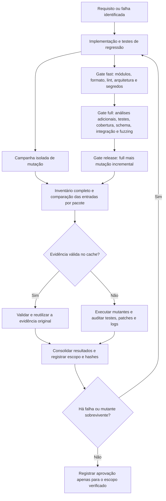

A campanha isolada não chama os gates `fast` ou `full`. O modo `release` inclui o `full`, mas também usa mutação incremental; `--refresh` é a opção que força a reexecução dos pacotes. A aprovação global de mutação exige inventário completo, todos os candidatos `KILLED` e 100% de cobertura e eficácia. Uma campanha com `--package` é parcial.

### O que cada camada verifica

| Camada | Ferramentas e método | O que se procura detectar | Registro produzido |
| --- | --- | --- | --- |
| Dependências reproduzíveis | Go Modules, `tidy -diff`, `verify` e manifesto de ferramentas | Módulo inconsistente, checksums inválidos ou ferramenta diferente da fixada | Logs de módulos e [tools.lock](tools/quality/tools.lock) |
| Formatação e análise estática | golangci-lint/gofumpt, go-arch-lint, NilAway e deadcode | Erros estáticos, dependências entre camadas, possíveis acessos nil e código sem uso | Logs individuais do gate |
| Segurança | Gitleaks, govulncheck e OSV-Scanner | Segredos publicáveis e vulnerabilidades conhecidas no código/dependências | Logs e relatório de segredos com valores redigidos |
| Comportamento unitário | `go test`, regressões e execução com shuffle | Regras monetárias, estados, idempotência, autorização e caminhos de erro | Saída dos testes por pacote |
| Concorrência em memória | Race detector | Corridas de dados nos caminhos exercitados | Logs da execução com `-race` |
| Cobertura de statements | Perfil atômico com `-race -tags faults` | Trechos não exercitados em domínio, casos de uso e autenticação | `unit.out`, `functions.txt` e `unit.html` |
| Schema e persistência | Migrations up/down/up, equivalência e PostgreSQL descartável | Quebra de schema, constraints, imutabilidade e atomicidade | Logs de schema e suíte PostgreSQL |
| Sistema distribuído | PostgreSQL, Keycloak e MiniStack reais; três processos; falhas controladas | Duplicidade, disputa financeira, replay, crash, reentrega, recuperação e shutdown | Logs das suítes de integração |
| Fuzzing | Money contra um oráculo `math/big.Int`, por 30 segundos | Divergências aritméticas e casos de limite | Log do fuzzing |
| Mutação | Gremlins 0.6.0, testes por pacote e auditoria de cada eliminação | Alterações artificiais no código que os testes deixam passar | Inventário, resultados, patches, logs e classificação das eliminações |
| Aceitação | Matriz e relatórios Go de critérios | Rastreabilidade entre requisitos e cenários de teste | [Relatórios de aceite](docs/acceptance/README.md) |

O gate `full` reúne as camadas previstas em [scripts/check.sh](scripts/check.sh); aceitação tem comando próprio. A detecção por race e fuzzing depende dos caminhos e entradas executados. Cobertura mede execução de statements; mutação avalia a reação a mudanças artificiais. Nenhuma dessas medidas, isoladamente, comprova conformidade integral com o desafio.

### Resultados registrados

| Execução | Resultado observado | Escopo e evidência |
| --- | --- | --- |
| Integração de 29/09/2026 | 173 testes principais na suíte padrão, 60 na aplicação com `faults`, 65 no PostgreSQL e 33 no sistema distribuído/Fx; sem falhas ou skips | Execuções com race; contagens têm sobreposição e não devem ser somadas. [Relatório e hashes](docs/verification/integration-complete-2026-09-29/README.md) |
| Regressão LOSS → WIN de 30/09/2026 | PostgreSQL/race, regressões de lock/SQL, schema e vet aprovados; cobertura de statements de 1.360/1.360 nos sete pacotes medidos | Resultado daquela revisão, anterior aos reforços finais de mutação. [Relatório](docs/verification/loss-win-fix-2026-09-30/README.md) |
| Mutação completa concluída em 01/10/2026 | 2.067 mutantes em 25 pacotes; 100% de cobertura e eficácia de mutação; zero sobreviventes, zero candidatos sem cobertura e zero timeouts | 1.725 eliminações por falhas de teste e 342 rejeições de compilação. [Registro e localização dos artefatos](VERIFICATION.md#mutação-incremental--01102026) |
| Reutilização incremental após ajustes finais | 23 pacotes reutilizados e 2 reexecutados; campanha completa aprovada | `.local/mutation-campaign.Zl8io3/summary.json` |
| Reutilização sem alterações de entradas | 25 pacotes reutilizados e nenhum reexecutado; evidências validadas e campanha completa aprovada | `.local/mutation-campaign.UqSfWC/summary.json` |
| Gate geral após os ajustes finais de mutação | Não reexecutado nessa etapa | A aprovação da campanha isolada não representa uma nova aprovação de `full` ou `release` |

### Como os mutantes foram eliminados

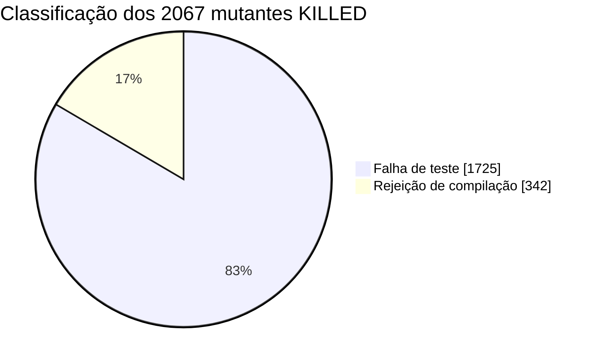

| Classificação | Quantidade | Parcela do total | Interpretação |
| --- | ---: | ---: | --- |
| Falha de teste | 1.725 | 83,45% | A alteração provocou uma falha de teste registrada e auditada |
| Rejeição de compilação | 342 | 16,55% | O compilador rejeitou a alteração, com diagnóstico no arquivo mutado; não é detecção por asserção |
| Sobrevivente | 0 | 0% | Nenhum candidato terminou como sobrevivente |
| Sem cobertura ou timeout | 0 | 0% | Nenhum candidato terminou nesses estados |
| **Total** | **2.067** | **100%** | Todos os registros brutos foram classificados como `KILLED` |

O auditor rejeita falhas de preparação do teste, confere os candidatos contra o inventário e mantém os patches e logs originais. A classificação acima evita apresentar mutantes que não compilam como se tivessem sido detectados por uma asserção. Ela corresponde à campanha registrada, não a uma nova execução após esta edição do README.

### Por que as próximas campanhas são incrementais

| Situação | Decisão do executor | Evidência mantida |
| --- | --- | --- |
| Entradas e ferramentas compatíveis com um resultado aprovado | Revalidar os artefatos e reutilizar o pacote | Origem, chave do cache e relatório reutilizado |
| Fontes, testes aplicáveis, dependências ou entradas auxiliares alterados | Reexecutar os pacotes invalidados | Novos testes, patches, logs e hashes |
| Resultado anterior reprovado | Executar novamente | A falha não é convertida em aprovação por estar no cache |
| Entradas alteradas durante a campanha | Impedir a publicação dos resultados no cache | Campanha não aprovada para o estado alterado |
| Seleção por `--package` | Limitar o escopo solicitado | Resumo marcado como parcial |
| Execução com `--refresh` | Reexecutar os pacotes selecionados, todos por padrão | Evidência nova sem reutilização dos resultados anteriores |

Na confirmação após os ajustes finais, **92% dos pacotes foram reutilizados** (23/25); sem mudanças, **100%** (25/25). Isso mede reutilização, não redução percentual de tempo: mesmo uma execução inteiramente em cache refaz o inventário e valida as evidências. Entradas auxiliares compartilhadas, incluindo documentação considerada pelo executor, podem invalidar vários pacotes. Os detalhes estão no [guia de qualidade](docs/guias/qualidade.md#campanha-de-mutação-incremental).

### Onde consultar os relatórios

| Relatório | Local | Como interpretar |
| --- | --- | --- |
| Etapas do gate | `.local/quality-results/run.*/status.tsv` e logs associados | Cada linha registra uma etapa e seu código de saída; uma falha reprova o gate |
| Cobertura de statements | `.local/coverage/unit.html`, `functions.txt` e `unit.out` | Percentuais do escopo configurado; o diretório padrão é atualizado pela próxima execução |
| Resumo de mutação | `.local/mutation-campaign.*/summary.json` | `complete` indica escopo completo; `passed` registra aprovação; cada pacote informa reutilização e origem |
| Mutantes e classificação | `results.json` e `classifications.json` no diretório da campanha | Estados brutos e separação entre falhas de teste e rejeições de compilação |
| Auditoria de mutação | Diretórios dos pacotes, origens apontadas pelo resumo, `inputs.tsv` e `toolchain.txt` | Permitem relacionar resultados a entradas, ferramentas, patches e logs |
| Histórico versionado | [VERIFICATION.md](VERIFICATION.md) e relatórios vinculados | Evidências datadas, hashes e limites de validade de cada execução |
| CI | Artefato `quality-evidence` do [workflow](.github/workflows/quality.yml) | O workflow publica `.local/quality-results/`; não publica atualmente os diretórios completos de mutação nem persiste seu cache entre runners |

Os artefatos em `.local/` são locais e ignorados pelo Git: não acompanham um clone novo. A existência de um comando ou configuração de CI não comprova sua execução. O workflow configura `full` para pushes/pull requests e oferece `release` no disparo manual; hooks opcionais executam `staged`/`fast` no pre-commit e `full` no pre-push. Instalar ferramentas não ativa hooks automaticamente.

Esta seção foi elaborada a partir dos scripts e das evidências existentes, sem executar gates, testes ou uma nova campanha. Resultados históricos valem para as entradas registradas; alterações posteriores precisam de validação própria antes de receber nova aprovação.

## Diagramas da solução implementada

As visões abaixo descrevem o código e a configuração do repositório. No modelo C4, C2 representa containers, C3 componentes e C4 o detalhe de código; incluímos também C1 para situar os sistemas envolvidos. As setas indicam a relação descrita em cada desenho. Os diagramas usam Mermaid e podem ser visualizados diretamente em leitores Markdown compatíveis.

| Visão | O que explica |
| --- | --- |
| [Contexto e containers](#contexto-e-containers-c1-e-c2) | Integrações externas e responsabilidades dos serviços |
| [Componentes e código](#componentes-e-código-c3-e-c4) | Organização interna e fronteira transacional |
| [Camadas de engenharia](#camadas-de-engenharia) | Direção das dependências e composição da aplicação |
| [Infraestrutura física e lógica](#infraestrutura-física-e-lógica) | Implantação local, réplicas, filas e telemetria |
| [Modelo de dados](#modelo-de-dados) | Carteiras, contabilidade, liquidação e entrega durável |
| [Sequências](#sequências) | Ordem dos efeitos, commit, ACK e publicação |
| [Fluxos financeiros](#fluxos-financeiros) | Decisão de processamento e partidas contábeis |
| [Estados](#estados) | Ciclos de transações, apostas e liquidações |

### Contexto e containers (C1 e C2)

**C1 — contexto.** Provedores enviam operações; o serviço interno administra carteiras, apostas e liquidações. O Keycloak fornece identidade para HTTP. A entrada SQS é publicada por um serviço interno de ingestão confiável, com credenciais e políticas IAM do broker. O consumidor dos eventos financeiros de saída é uma integração externa.

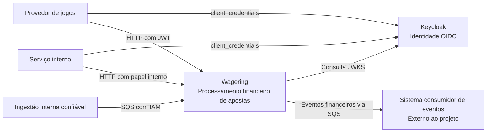

**C2 — containers.** A API e os workers pertencem ao mesmo executável Go. Os papéis são ativados por `ROLES`; não representam microserviços independentes. PostgreSQL concentra a coordenação durável entre instâncias.

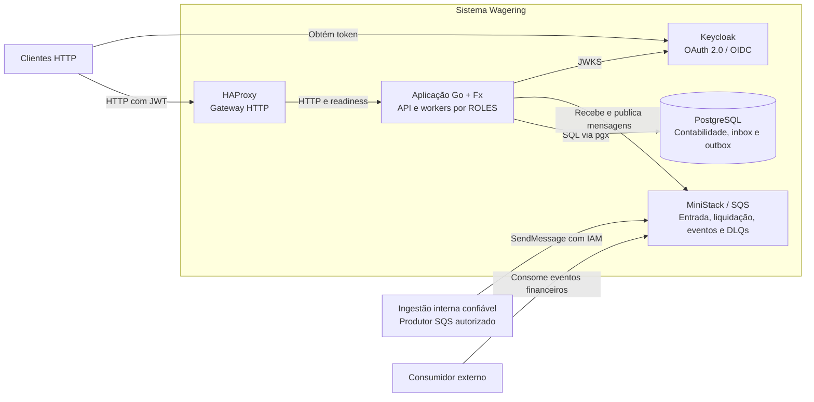

Fontes: [composição Fx](cmd/wagering/app.go), [Compose](docker-compose.yml) e [autenticação](ARCHITECTURE.md#autenticação-e-autorização).

### Componentes e código (C3 e C4)

**C3 — componentes da aplicação.** HTTP e SQS convergem no mesmo caso de uso financeiro. O worker de pendências retoma operações persistidas; a liquidação tem consumidor próprio na fila privada.

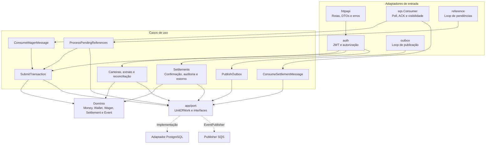

**C4 — detalhe de código do processamento financeiro.** Diagrama simplificado dos tipos e interfaces reais; cada `txAdapter` usa a mesma transação SQL. As operações SQL persistem a decisão e reforçam as invariantes contábeis.

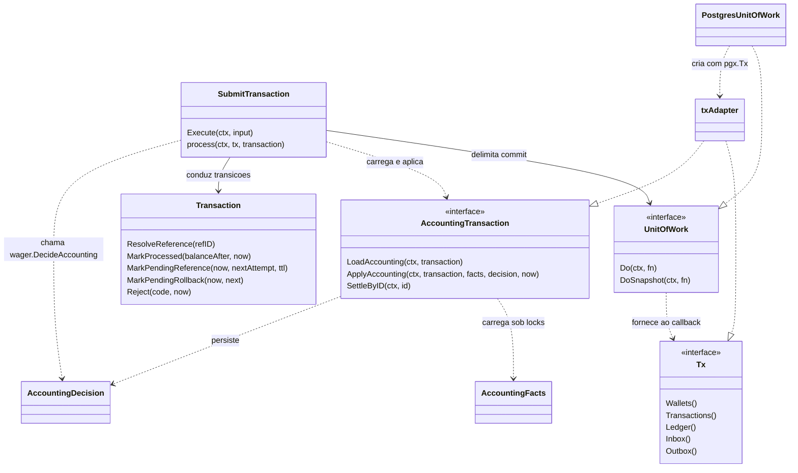

`PostgresUnitOfWork` identifica no desenho o tipo `postgres.UnitOfWork`, distinguindo-o da interface `port.UnitOfWork`. Fontes: [ports](internal/app/port/ports.go), [processamento](internal/app/usecase/process.go), [decisão contábil](internal/domain/wager/accounting.go) e [UnitOfWork PostgreSQL](internal/infra/postgres/uow.go).

### Camadas de engenharia

As setas contínuas indicam dependências de código; as tracejadas mostram a composição pelo Fx. O domínio encapsula regras e valores, enquanto a aplicação depende de interfaces para executar I/O.

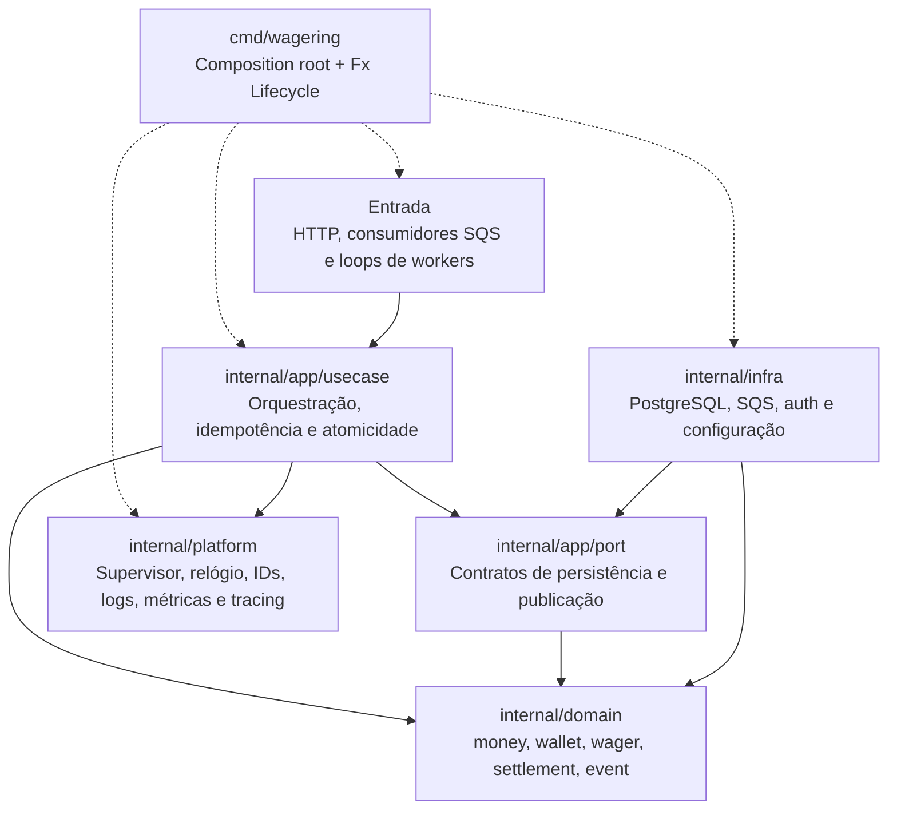

O detalhe dos módulos e da ordem de encerramento está em [Dependências e fronteiras](ARCHITECTURE.md#dependências-e-fronteiras).

### Infraestrutura física e lógica

**Implantação física local.** O desenho representa `bash scripts/up.sh --replicas 3` em um único host Docker; o Compose usa uma réplica por padrão. Cada réplica tem processo, memória e pool próprios. As portas publicadas ficam em `127.0.0.1`.

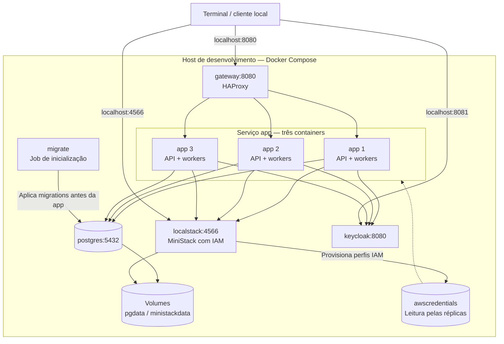

**Topologia lógica de mensageria e telemetria.** Filas públicas de entrada, privadas de liquidação e de saída têm funções distintas. Logs, métricas e traces acompanham o processamento; o ledger permanece no PostgreSQL.

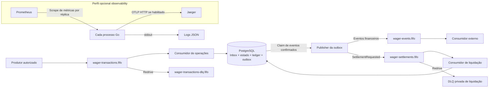

Fontes: [Compose](docker-compose.yml), [provisionamento SQS/IAM](deploy/localstack/init), [publisher](internal/infra/sqs/publisher.go) e [observabilidade](docs/OBSERVABILITY.md).

### Modelo de dados

**Núcleo contábil.** Cada carteira lógica possui duas contas, uma `GUARANTEE` e uma `OPERATIONAL`. O ER abaixo resume as relações principais; as chaves compostas também validam carteira, papel e moeda nas migrations. Um diário interno exige exatamente duas partidas; `OPENING` tem uma partida externa.

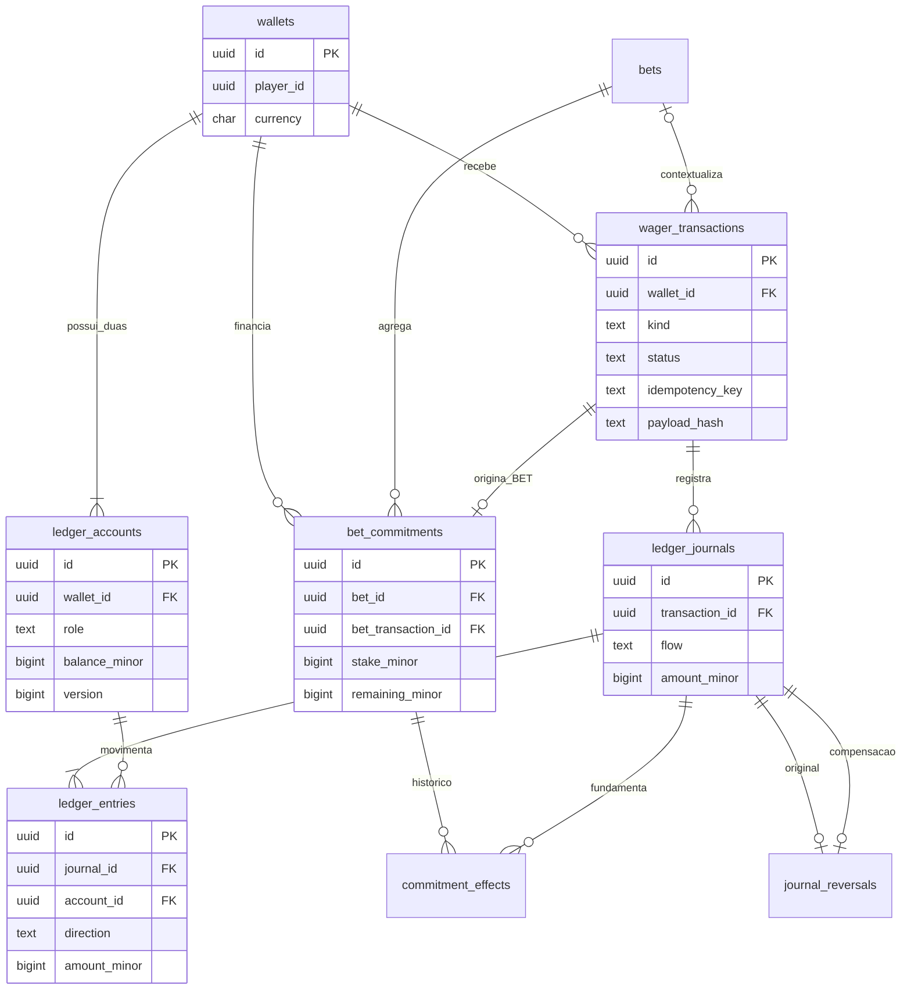

**Liquidação, entrega e rastreabilidade.** Relações opcionais representam registros que só existem em determinados fluxos. As tabelas de trace context guardam metadados de transporte separados dos fatos financeiros.

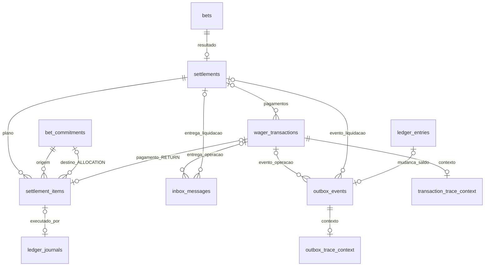

As views `wallet_balances` e `wallet_ledger_entries` expõem a conta de garantia usando o ID da carteira lógica. A reconciliação HTTP lê essas projeções em um snapshot consistente. O histórico físico inclui também as partidas operacionais e as compensações. Fontes: [modelo de dados](docs/database/README.md), [migration contábil](migrations/000003_accounting_model.up.sql) e [contexto de tracing](migrations/000014_trace_context.up.sql).

### Sequências

**BET via HTTP e replay.** O exemplo apresenta uma aposta válida com saldo suficiente. O cliente recebe o resultado depois do commit; um replay equivalente devolve o snapshot original, mesmo que o saldo atual já tenha mudado.

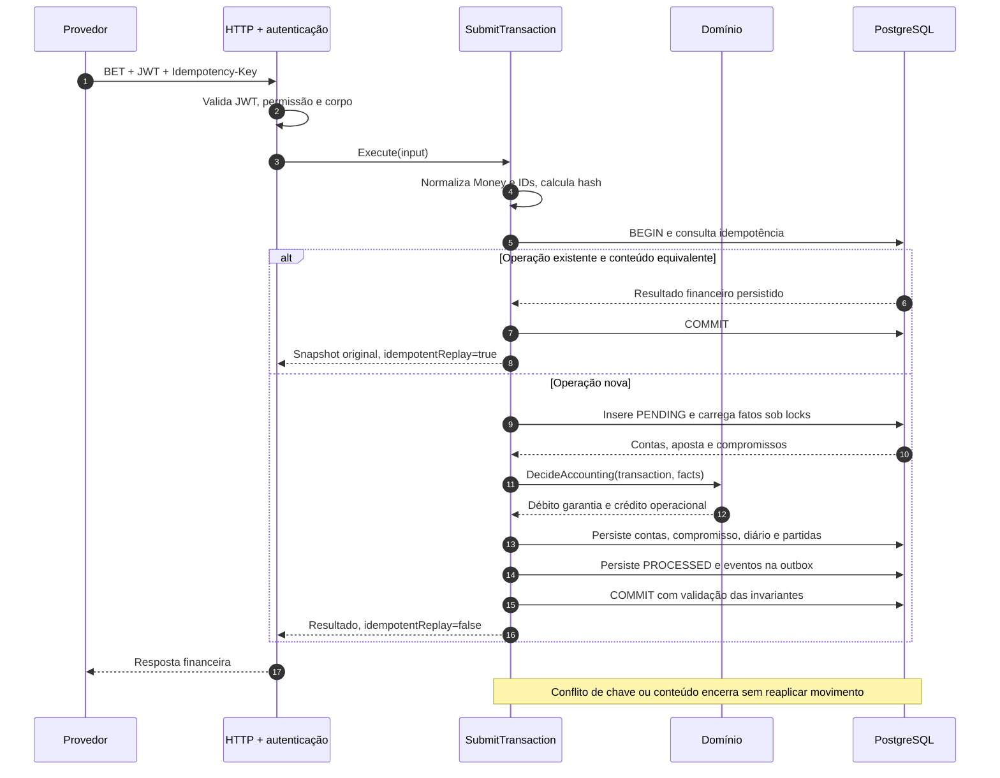

**SQS, commit e publicação da outbox.** Uma pendência persistida também permite ACK da entrada: sua retomada passa a ser responsabilidade do worker. A publicação pode ser repetida após falha; o `eventId` é preservado.

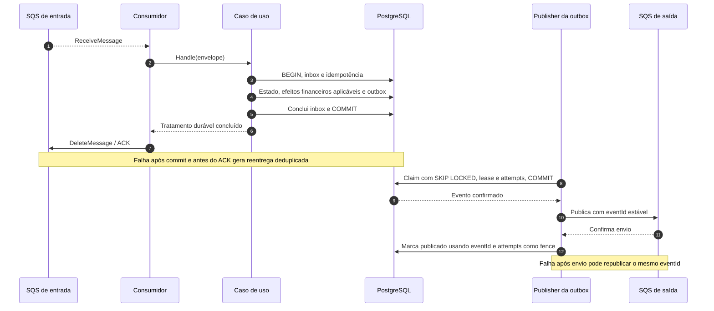

**Confirmação e liquidação assíncrona.** O plano é persistido antes de ser executado. O consumidor privado recebe apenas a identidade da liquidação e executa os valores já registrados.

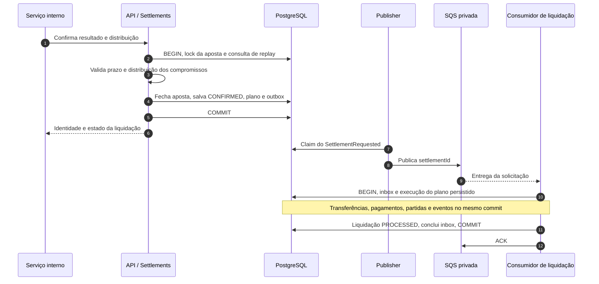

Fontes: [submissão](internal/app/usecase/transaction.go), [workers](internal/app/usecase/workers.go), [confirmação](internal/app/usecase/settlement.go) e [consumidor privado](internal/app/usecase/settlement_message.go).

### Fluxos financeiros

**Decisão de uma operação externa.** O fluxo resume os caminhos de negócio dentro da UnitOfWork. Erros técnicos abortam a tentativa SQL; quando transitórios, podem ser repetidos sem reaplicar efeitos confirmados.

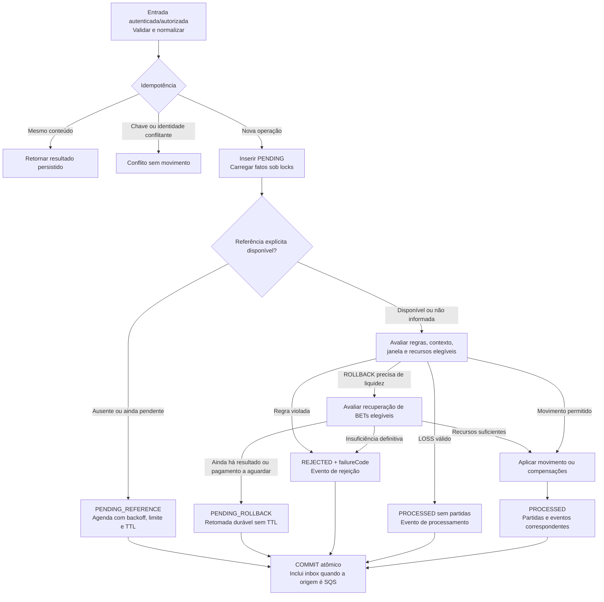

WIN sem referência explícita resolve a BET elegível mais antiga no mesmo contexto; se não houver candidata, é rejeitada. A recuperação de ROLLBACK confirma compensações completas ou mantém a pendência, sem estorno parcial.

**Circulação dos recursos.** Exemplo de BET individual de 25.00 sobre saldo inicial de 100.00. Os números no desenho são ilustrativos; cada operação tem seu próprio commit e diário.

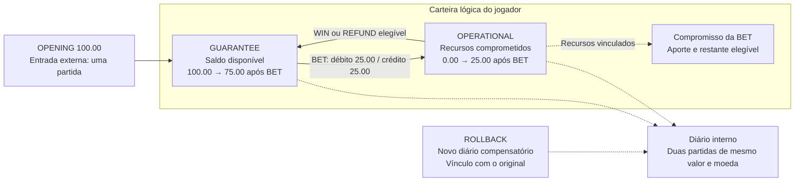

Na liquidação compartilhada, o plano pode transferir recursos entre contas operacionais de participantes antes do retorno à garantia. `LOSS` registra o resultado sem movimentar contas. As regras estão em [DecideAccounting](internal/domain/wager/accounting.go) e nos [contratos financeiros](docs/CONTRACTS.md).

### Estados

**Transação financeira externa.** Estados terminais são imutáveis. Replay é uma leitura do resultado; uma reversão é outra transação, com novos lançamentos.

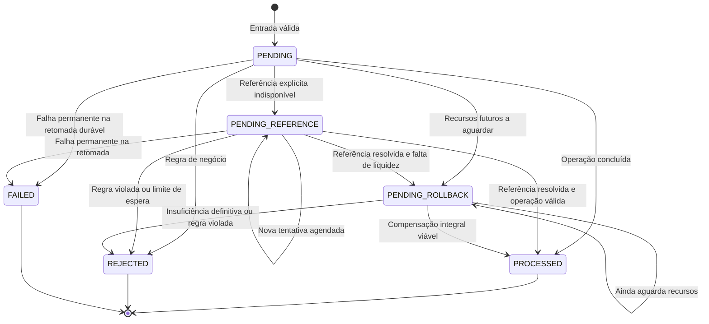

`PENDING_REFERENCE` tem limite de oito registros de espera e TTL de dez minutos. `PENDING_ROLLBACK` não usa esse limite ou TTL e não é convertido em `FAILED` pelo worker em uma falha de infraestrutura. `OPENING` é interno e já nasce `PROCESSED` quando há saldo inicial positivo. Fontes: [transação](internal/domain/wager/transaction.go) e [retomada](internal/app/usecase/workers.go).

**Aposta e liquidação.** O prazo de admissão e o estado SQL da aposta são dimensões distintas: atingir o prazo bloqueia novas BETs/REFUNDs, mas não altera automaticamente `OPEN` para `CLOSED`. A confirmação do resultado fecha a aposta e cria a liquidação.

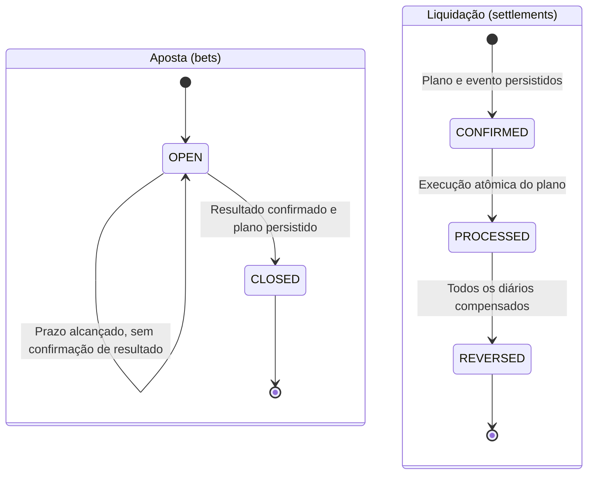

Uma compensação parcial do conjunto de pagamentos, por ROLLBACK de uma WIN específica, preserva as outras WINs; `REVERSED` identifica a compensação completa da liquidação. Estornar não reabre a aposta. Fontes: [confirmação](internal/app/usecase/settlement.go), [estorno](internal/app/usecase/settlement_audit.go) e [regras SQL de compensação](migrations/000010_rollback_any_stage.up.sql).

## Como interpretar as evidências

Os registros versionados permitem conferir como as garantias descritas neste projeto foram verificadas. Sua finalidade é tornar a avaliação reproduzível e rastreável: relacionar cenários, resultados e, quando registrados, hashes dos fontes utilizados. Mantê-los no repositório permite consultar os relatórios e suas evidências junto ao histórico da entrega.

Os [relatórios resumidos](VERIFICATION.md) são o ponto de entrada. Logs, patches de mutação e demais saídas brutas permitem aprofundar a inspeção; não é necessário ler cada arquivo para compreender a solução. Os registros datados preservam resultados da respectiva etapa, incluindo falhas e correções, e não devem ser interpretados como validação automática da versão atual.

Para avaliar a entrega, comece pelas [instruções de execução](#instalação-em-um-comando), pelo [roteiro demonstrativo](#nosso-roteiro-demonstrativo) e pelo [processo de qualidade e resultados](#processo-de-qualidade-e-resultados). Consulte as evidências detalhadas para verificar uma afirmação específica. O [relatório de execução limpa](docs/verification/clean-start-2026-10-01/README.md) registra o ambiente, os fontes e os cenários daquela demonstração; as [execuções do CI](https://github.com/JimSP/wagering/actions/workflows/quality.yml) identificam o commit avaliado e o resultado das verificações executadas.

## Notas do autor

Este projeto foi desenvolvido sob um prazo de três dias, com diversas dificuldades ao longo da implementação. Para mim, seria impossível entregar sozinho, nesse período, o desafio com o escopo e o nível de exigência que busquei. Por isso, recorri de forma intensiva e extensiva a um modelo de linguagem, por meio do Codex, durante a construção da solução.

Quero ser transparente também sobre a revisão: não seria possível revisar pessoalmente todo esse volume de código, com a mesma profundidade e a régua de qualidade adotada, dentro desse prazo. Os testes, verificações automatizadas e registros de execução ajudam a avaliar o resultado, mas não equivalem a uma revisão humana integral. Não apresento esta entrega como código inteiramente escrito ou revisado por mim, linha a linha.

**Essa limitação tornou a metodologia de qualidade uma parte central da entrega.** Dei especial importância a práticas consolidadas de engenharia de software: análise estática, testes de comportamento, cobertura, detecção de condições de corrida, integração com infraestrutura real e testes de mutação. Busquei apoiar a confiança no resultado em verificações reproduzíveis, com critérios explícitos de aprovação e evidências que outra pessoa pudesse inspecionar e executar.

Cada camada responde a uma pergunta diferente. A cobertura mostra quais trechos foram exercitados; os testes de comportamento verificam resultados e invariantes; a mutação avalia se os testes percebem alterações introduzidas deliberadamente no código. Os cenários distribuídos exercitam concorrência, duplicidade e recuperação com processos independentes e serviços reais. No domínio financeiro, conferir saldos, partidas, referências e eventos permite verificar se uma operação produziu o efeito esperado e se uma rejeição preservou os recursos.

Escolhi essa combinação porque uma métrica isolada pode transmitir uma confiança que não sustenta. Executar uma linha não significa conferir seu resultado, e um teste aprovado pode deixar de perceber um defeito. Por isso, atribuí importância tanto à abrangência dos testes quanto à capacidade de detectar falhas, usando valores esperados explícitos, oráculos independentes quando aplicáveis e conferência dos efeitos persistidos. Logs, hashes dos fontes e comandos de reprodução vinculam cada resultado à versão efetivamente avaliada.

As evidências incluem a campanha registrada de **2.067 mutantes**, sem sobreviventes, com distinção entre eliminações por testes e rejeições de compilação, e a demonstração em ambiente limpo com **28 cenários aprovados**, banco novo e três réplicas. São verificações complementares, com escopos e versões descritos nos [registros de qualidade](VERIFICATION.md) e no [relatório de execução limpa](docs/verification/clean-start-2026-10-01/README.md).

É nesse sentido que a metodologia sustenta as garantias da entrega: transforma o comportamento declarado em condições verificáveis e registra se elas foram satisfeitas nas execuções realizadas. Não considero esses números uma prova de ausência de defeitos ou de aderência automática a qualquer interpretação do desafio. Considero-os a base objetiva para avaliar o que foi construído, identificar os limites conhecidos e permitir que o avaliador confira o resultado sem depender apenas da minha descrição ou da resposta de um modelo de linguagem.

Ao definir a abordagem, quis demonstrar o que aprendi em vinte anos de mercado, trabalhando com instituições financeiras. Essa experiência orientou a importância dada à origem e ao destino dos recursos, às contrapartidas contábeis, à rastreabilidade, à conciliação e às consequências de uma reversão. Também motivou a ampliação do modelo financeiro além do mínimo solicitado, com as vantagens e os trade-offs descritos neste README.

Não sou um gênio da programação ou dos sistemas distribuídos. Minha experiência como engenheiro de software e arquiteto de soluções faz parte da minha trajetória, mas considero que meu principal valor está no conhecimento dos problemas, das dificuldades e das soluções do setor financeiro. É esse repertório que procurei tornar visível nas decisões do projeto.

O uso extensivo de IA faz parte da história desta entrega e precisa ser conhecido por quem a avalia. Assumo a responsabilidade pela abordagem escolhida e pela forma como apresento o resultado, incluindo as diferenças em relação ao desafio e os limites da revisão que consegui realizar.
