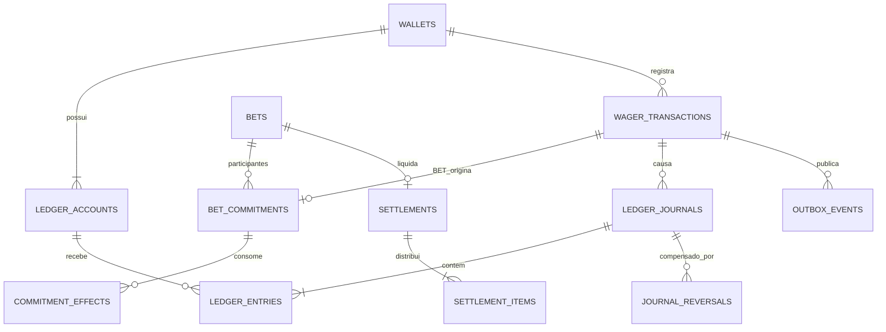

> **Registro histórico, limitado à etapa e aos fontes daquela execução.** Não é documentação operacional vigente nem comprovação de autorização do usuário. Expressões como “atual”, “confirmado”, “autorizado” e “concluído” no texto abaixo pertencem ao registro do agente e não prevalecem sobre DESAFIO.md. Consulte a [documentação atual](../../README.md) e os limites de evidência em VERIFICATION.md.

> **Implementação posterior:** [modelo vigente e gestão](../../database/README.md), migrations 000003–000006. Este documento preserva a proposta revisada; os limites efetivamente implementados e a integração ainda pendente estão registrados no documento vigente.

# Modelo recomendado para cumprir o desafio com contrapartidas

**Proposta de estrutura e invariantes, não DDL aplicado.** Nomes novos abaixo são escolhas técnicas propostas. O contrato de referência continua sendo DESAFIO.md, com garantia exclusiva e liquidação por aposta já definidas pelo usuário. Não se presume que os testes existentes tornem esses nomes ou suas representações obrigatórios.

## 1. Carteira do jogador e contas contábeis são identidades diferentes

A carteira lógica mantém `walletId`, jogador e moeda, com unicidade jogador/moeda. Ela possui duas contas: **disponível na garantia própria** e **comprometido na conta operacional**. O saldo principal devolvido pelo contrato do desafio representa o disponível. O comprometido pode ser consultado separadamente; não deve substituir silenciosamente o saldo principal.

Isso resolve a aparente oposição apresentada incorretamente pelo agente:

| Operação | Efeito no disponível do jogador | Contabilização |
|---|---|---|
| OPENING100 | 0→100 | Entrada externa de 100 na garantia; operacional nasce zero. Um OPENING, não abertura rejeitada seguida de depósito obrigatório. |
| BET25 | 100→75 | Débito25 na garantia e crédito25 no operacional da mesma carteira. |
| WIN35, financiada por aposta25 + perda10 | 75→110 | Transferência10 do compromisso perdedor ao operacional vencedor; débito35 do operacional vencedor e crédito35 na garantia vencedora. |
| LOSS0 | Disponível não muda | O comando LOSS continua sem lançamento e sem incremento de versão. O financiamento ao vencedor é movimento da liquidação, com identidade própria, não uma LOSS0 transformada em débito de valor positivo. |
| REFUND25 antes do fechamento | 75→100 | Débito25 do compromisso operacional e crédito25 na própria garantia, uma única vez. |
| ROLLBACK | Inverso auditável dos efeitos elegíveis | Novas partidas compensatórias, referenciando as originais; nenhum saldo negativo e nenhuma edição do histórico. |

Exemplo completo confirmado: depósitos A100/B50; BET A25/B10; perda10 de B financia A; retorno35 a A. Final: garantia A110, operacional A0, garantia B40, operacional B0. Total150. O retorno não é um novo depósito externo.

**Impacto identificado nos testes:** os checkpoints de contas G/W podem permanecer, mas alguns asserts HTTP atuais usam `step.want.wallet` — saldo operacional — como `balance` do jogador. Isso precisa ser alinhado na implementação/projeção: BET25 sobre disponível100 deve devolver75, não25. Acrescentar contas internas não muda o sentido de débito/crédito do contrato externo. Esta é uma consequência do desafio, não uma regra nova de negócio.

O diagrama resume cardinalidades, não todas as FKs. Uma carteira válida exige exatamente as duas contas no commit; a aposta pode estar aberta sem participantes, mas não pode ser fechada vazia. WIN processada também possui vínculo obrigatório para sua BET original, descrito abaixo.

## 2. Tabelas, campos, tipos e chaves

### `wallets` — raiz lógica preservada

| Campo | Tipo / regra |
|---|---|
| `id` | UUID PK; identidade externa da carteira, imutável. |
| `player_id` | UUID NOT NULL; identificador do jogador, sem inventar cadastro local obrigatório. |
| `currency` | CHAR(3) ou TEXT com CHECK da lista suportada e escala2. |
| `created_at`, `updated_at` | TIMESTAMPTZ NOT NULL; `updated_at >= created_at`. |

Chaves: `UNIQUE(player_id,currency)` e `UNIQUE(id,currency)` como alvo de FK composta. Saldo e versão do agregado são obtidos da conta disponível, via JOIN/projeção; **não manter uma terceira cópia de saldo além das duas contas**. Se a implementação mantiver cache na raiz por desempenho, sua igualdade com a conta disponível precisa ser garantida no commit; não é a opção recomendada inicialmente.

### `ledger_accounts` — contas de disponível e comprometido

| Campo | Tipo / regra |
|---|---|
| `id` | UUID PK, distinto de `wallets.id`. |
| `wallet_id`, `currency` | UUID/TEXT NOT NULL; FK composta para carteira/moeda. |
| `role` | TEXT NOT NULL; CHECK `GUARANTEE` ou `OPERATIONAL`. Identidade imutável. |
| `balance_minor` | BIGINT NOT NULL; CHECK >=0. |
| `version` | BIGINT NOT NULL; inicial1; muda apenas com movimento de saldo dessa conta. |
| `created_at`, `updated_at` | TIMESTAMPTZ NOT NULL, ordem válida. |

`UNIQUE(wallet_id,role)` impede múltiplas garantias/operacionais. Não basta para exigir existência: abertura deve criar ambas na mesma transação e constraint trigger diferido deve conferir o par completo. FK impede uma garantia de outra moeda; conta pertence a uma única carteira, impedindo compartilhamento. Não usar `UNIQUE(player_id,currency)` nas contas para tentar representar duas raízes de carteira.

### `wager_transactions` — operação de negócio e resultado de replay

Preservar IDs e metadados atuais: `id UUID PK`, `wallet_id UUID FK`, `player_id UUID`, `origin TEXT`, `provider_id/external_transaction_id/idempotency_key/payload_hash TEXT`, `game_id/round_id TEXT`, `kind/status/failure_code TEXT`, `amount_minor BIGINT`, `currency`, `correlation_id/causation_id TEXT`, timestamps, tentativas e agendamento. Preservar as duas unicidades externas independentes.

Acrescentar/explicitar:

| Campo / chave | Regra |
|---|---|
| `bet_id UUID` | FK para aposta; obrigatório para BET/WIN bem-sucedidas. Pode ficar NULL durante rejeição por aposta inexistente ou resolução pendente. |
| `reference_external_id TEXT NULL` | Dado de entrada, opcional para WIN. Obrigatório para REFUND/ROLLBACK conforme desafio. |
| `reference_transaction_id UUID NULL` | FK para operação original. **NOT NULL condicional em WIN/REFUND/ROLLBACK processadas.** A ausência da referência externa não desliga essa regra. |
| `result_account_id UUID`, `balance_after_minor BIGINT` | Snapshot da conta disponível e do saldo efetivamente retornado ao jogador. Obrigatórios quando resultado processado é aplicável; nunca recalculados no replay. |
| `settlement_id UUID NULL` | Associação com a liquidação que causa o pagamento, quando aplicável. |
| `UNIQUE(wallet_id) WHERE kind='OPENING'` | Uma única abertura positiva. Abertura zero não inventa operação de valor zero. |
| Reversão única por referência processada | Preservar a proteção atual entre REFUND/ROLLBACK, além das proteções por diário compensado. |

Guarda de WIN no estado processado: alvo existe, é BET processada, corresponde ao `bet_id` e ao contexto exigido — provedor, jogador, carteira, moeda e rodada — e o pagamento tem financiamento elegível vinculado aos compromissos. Não acrescentar igualdade de `game_id` à regra de referências por conta própria: a lista do desafio não a exige e os testes preservam esse caso.

Quando a referência externa não vem, a aplicação/rotina deve resolver uma BET inequívoca pelo contexto persistido e **gravar o vínculo interno**. Se o contexto permitir mais de uma candidata, não escolher “a última” nem gastar um saldo agregado: o pedido precisa ser desambiguado ou recusado, sem efeitos. O schema não deve assumir que rodada equivale a aposta nem impor uma BET por rodada/carteira sem requisito explícito.

Shapes de estado: PROCESSED exige resultado coerente e nenhum failure_code; REJECTED/FAILED exigem failure_code e não carregam saldo de sucesso; PENDING_REFERENCE exige referência/agendamento/expiração válidos. Tentativas não negativas, identidades externas não vazias e timestamps coerentes. Campos de negócio imutáveis, referências resolvidas não podem trocar silenciosamente de alvo e estados terminais não mudam.

A origem do chamador não é a origem do dinheiro: OPENING é solicitado internamente, mas representa entrada externa de recursos. Depósitos internos auditados precisam de tipo/identidade persistente próprios; pode-se ampliar o discriminador de operações internas sem liberar esses tipos no endpoint de apostas. Saque foi citado como fronteira contábil, não como autorização para implementar um novo endpoint nesta revisão.

### `bets` e `bet_commitments` — a aposta existe além do saldo

`bets`: `id UUID PK`, identificadores de contexto `provider_id/round_id/game_id TEXT`, `currency`, `status TEXT`, `created_at/closed_at TIMESTAMPTZ`, `version BIGINT`. Contexto e conjunto ficam imutáveis após fechamento. Não fechar conjunto vazio; fechamento, novas BETs e REFUND disputam a mesma linha/versão da aposta. Sem cadastro local fictício de provedores ou jogos: IDs externos opacos podem permanecer TEXT.

`bet_commitments`: `id UUID PK`, `bet_id UUID FK`, `bet_transaction_id UUID FK UNIQUE`, `wallet_id UUID FK`, `currency`, `stake_minor BIGINT >0`, `remaining_minor BIGINT entre0 e stake`, timestamps e versão de concorrência. Contas de origem/destino são derivadas do par exclusivo; se IDs de conta forem materializados, usar FKs compostas para impedir troca de dono/papel/moeda. A BET de origem deve estar processada, no mesmo contexto, com valor igual ao compromisso.

`commitment_effects`: `id UUID PK`, `commitment_id UUID FK`, operação/liquidação/diário causador, tipo de efeito, montante positivo, instante, referência ao efeito compensado quando existir. Append-only e identidade única do efeito. A soma dos consumos/liberações deve explicar exatamente o `remaining_minor`; esse campo é projeção controlada, não saldo livremente editável.

Lock no compromisso antes de consumir; conferir limite no mesmo UPDATE/transação. Um saldo operacional de 50 com compromissos de 20 e30 em apostas diferentes não autoriza pagar35 com o compromisso de20. Compensar uma liquidação não reabre a aposta nem torna seus compromissos novamente elegíveis por simples reposição de `remaining_minor`.

### `settlements` e `settlement_items` — intenção fechada e execução por ID

`settlements`: `id UUID PK`, `bet_id UUID FK UNIQUE`, identidade durável do resultado, hash da distribuição, moeda, estado e timestamps. Um resultado da aposta define um conjunto financeiro; outro `messageId` não cria outra liquidação. Payload/participantes/valores tornam-se imutáveis no fechamento. A reversão possui identidade própria e referencia esse resultado, não troca a identidade do original.

`settlement_items`: `id UUID PK`, `settlement_id UUID FK`, `bet_id UUID`, tipo `ALLOCATION` ou `RETURN`, compromisso de origem, compromisso de destino quando transferência entre participantes, `amount_minor BIGINT >0`, moeda, operação de pagamento associada e ordem estável. Referências compostas devem impedir itens de outra aposta/moeda. Retorno vai à garantia vinculada ao beneficiário, sem aceitar conta arbitrária.

No fechamento, validar os valores declarados e o conjunto completo; na execução, validar elegibilidade e recursos novamente sob lock. Ganhos/perdas/retornos precisam fechar por participante e globalmente. A rotina de execução recebe o ID e resolve todos os itens no PostgreSQL, sem distribuição em memória no Go. Sucesso significa todos os participantes, compromissos, partidas e eventos confirmados juntos.

**Uma mesma devolução não pode ser paga duas vezes por caminhos distintos.** A WIN externa e a entrega automática devem convergir para a identidade persistida do pagamento correspondente ao resultado/compromisso. Uma chave única do pagamento no plano, ligada à operação/diário, deve impedir duplicação mesmo com IDs de transporte diferentes. O desenho do endpoint/handler não substitui essa unicidade no banco.

### `ledger_journals` — diário de cada movimento

`id UUID PK`, `transaction_id UUID FK` para operação causadora, `settlement_item_id UUID NULL FK`, `currency`, `amount_minor BIGINT >0`, `flow TEXT` (`INTERNAL_TRANSFER`, `EXTERNAL_IN`, `EXTERNAL_OUT`), `created_at TIMESTAMPTZ`, identidade única do efeito e eventual referência de compensação. Uma operação pode causar mais de um diário — por exemplo, financiamento e retorno de WIN. Não exigir que todos os diários tenham valor igual ao total da operação.

- Movimento interno: débito e crédito iguais, contas distintas, moeda única e participantes autorizados pelo plano. A opção inicial recomendada é um diário por transferência com duas partidas; a liquidação composta agrupa vários diários atomicamente.
- Entrada externa: um crédito local auditado para OPENING/depósito. Não inventar uma segunda conta interna para representar banco fora do escopo.
- Saída externa, quando implementada: um débito local auditado, sem saldo negativo. Não permitir que WIN seja classificada como entrada externa para contornar seu financiamento.
- Diário e partidas tornam-se selados/imodificáveis no commit. Não basta proibir UPDATE: também impedir adicionar nova partida a um diário já confirmado.

### `ledger_entries` — partidas imutáveis por conta

| Campo | Tipo / vínculo |
|---|---|
| `id` | UUID PK. |
| `journal_id` | UUID NOT NULL FK; movimento ao qual a partida pertence. |
| `transaction_id` | UUID NOT NULL; FK composta com o diário para a mesma operação causadora. |
| `account_id`, `wallet_id`, `account_role`, `currency` | Conta real e raiz lógica. FK composta para a identidade imutável da conta; redundância controlada para permitir constraints/índices de projeção, nunca valores independentes. |
| `direction` | TEXT com CHECK DEBIT/CREDIT. |
| `amount_minor` | BIGINT >0. |
| `balance_before_minor`, `balance_after_minor` | BIGINT >=0; aritmética exata pelo sinal. |
| `account_version` | BIGINT >=1; versão da conta naquele movimento, única por conta. |
| `seq` | BIGINT GENERATED ALWAYS AS IDENTITY, NOT NULL, UNIQUE e >0. |
| `created_at` | TIMESTAMPTZ NOT NULL. |

Chaves: `UNIQUE(account_id,journal_id)` para não repetir a conta dentro de um movimento; `UNIQUE(account_id,account_version)` para encadeamento; FK das contas/moedas; índice `(account_id,seq)` e acesso por diário/operação. Durante processamento, bloquear todas as contas envolvidas em ordem estável; alocar versão/seq da conta já sob lock. Sequências globais podem ter lacunas e não definem ordem de commit entre contas.

### Preservar `UNIQUE(walletId,transactionId)` do desafio

Não remover essa exigência para acomodar várias partidas. Ela se refere ao lançamento da **carteira do jogador por operação**; a contabilização interna tem uma granularidade adicional de conta/movimento.

Recomendo que `wallet_ledger_entries` seja a **projeção dos lançamentos da conta disponível**, usando `wallet_id` lógico e `transaction_id` de negócio. A fonte física continua única: `ledger_entries`. Garantir na tabela física `UNIQUE(wallet_id,transaction_id) WHERE account_role='GUARANTEE'`, com o papel protegido pela FK composta. Assim, o ledger do jogador contém OPENING100, BET−25, WIN+35 e reconcilia110; o livro interno contém também comprometimento e transferência entre participantes.

Movimentos intermediários podem repetir a conta operacional em diários diferentes. O retorno de uma operação para a garantia deve ser consolidado em uma única partida correspondente; sua decomposição fica nos itens da liquidação. Uma reversão composta deve preservar a mesma propriedade, com itens que apontem para todos os movimentos originais. **Não resolver isso apagando detalhes ou duplicando saldo em dois ledgers graváveis.**

A projeção é um modelo técnico recomendado para preservar simultaneamente a semântica externa e os detalhes internos. Expor consulta adicional do livro por conta é compatível; reutilizar `walletId` ora como raiz, ora como conta é ambíguo e deve ser evitado.

### `journal_reversals` — compensação sem alterar o original

Relaciona operação de ROLLBACK, diário original e diário compensador, montante/moeda e instante. FKs obrigatórias; original e compensador distintos; original elegível e processado. Proibir compensar duas vezes o mesmo movimento/efeito. Verificar que contas, valores e sinais da compensação invertem o original. Se vários movimentos forem consolidados no retorno à garantia, os itens preservam cada origem e a soma exata.

Original permanece intacto; compensação é novo registro. Em liquidação, todos os movimentos abrangidos pelo estorno devem ser compensados no mesmo commit; falta de recursos em qualquer conta aborta tudo. A aposta permanece fechada.

### `inbox_messages` e `outbox_events`

Inbox: manter PK `(consumer_name,message_id)`, hash, recebimento, conclusão e entregas. CHECKs de texto não vazio, `deliveries>=1`, conclusão não anterior ao recebimento. Identidade/hash imutáveis, conclusão não volta para NULL, contador cresce. Acrescentar ligação tipada à operação ou liquidação tratada; replay pode ter várias mensagens para a mesma identidade financeira. Não pode existir tratamento confirmado só na inbox sem seu resultado durável na mesma transação.

Outbox: manter eventId UUID PK e snapshot JSONB imutável. Acrescentar vínculos relacionais conforme tipo: `transaction_id`, `settlement_id` ou `ledger_entry_id`, sem tentar simular FK pelo texto dentro do JSON. `event_type`, versão, agregado, correlação e ocorrência precisam concordar com o payload. Tentativas >=0, próximo envio/lease/publicação coerentes e token de posse monotônico.

Unicidades por efeito: um evento terminal por resultado/transição, um evento de saldo por partida/projeção correspondente. Retry publica o mesmo eventId. Exigir os eventos corretos no commit, e também rejeitar eventos órfãos/extras que aleguem movimentos inexistentes.

**Identidade dos eventos:** `WalletBalanceChanged` externo deve continuar identificando a carteira e a mudança do saldo que o consumidor acompanha. Se as mudanças de contas internas também forem publicadas, precisam de identidade/papel/versão explícitos de conta — por exemplo, evento interno `AccountBalanceChanged`. Esse nome é proposta técnica. Não apresentar versão da conta operacional como versão do disponível nem confundir os dois IDs. Os quatro eventos exigidos pelo desafio permanecem.

## 3. Qual mecanismo garante cada regra

| Invariante | Mecanismo no banco |
|---|---|
| Tipos, domínio de moeda, montantes, nulabilidade, estado local | NOT NULL e CHECK por linha. |
| Uma carteira por jogador/moeda; um papel de conta por carteira | UNIQUE; não confiar em consulta prévia da aplicação. |
| Garantia própria, mesmo dono/moeda e papel fixo | FK composta + imutabilidade da identidade + verificação de par completo no commit. |
| WIN sempre pertence a BET; referências elegíveis | FK + CHECK condicional para presença + trigger de domínio independente do campo externo; alvo terminal e contexto exato. |
| Partidas equilibradas, número esperado, origem externa autorizada | Rotina transacional + constraint trigger diferido por diário. CHECK simples não soma outras linhas. |
| Saldo/versionamento/encadeamento | Lock da conta, aritmética exata, versão única e conferência final. Reconciliação independente da projeção. |
| Financiamento da mesma aposta e consumo único | FKs compostas de aposta/moeda, locks nos compromissos, atualização condicionada e unicidade do efeito/pagamento. |
| Fechamento versus nova BET/REFUND | Mesmo lock/versão de aposta; conjunto imutável depois de fechado. |
| Atomicidade de lote, inbox e outbox | Uma transação SQL; nenhum commit parcial e nenhum evento externo publicado antes dela. |
| Estorno único e integral | Identidade do alvo + unicidade dos itens de reversão + comparação das partidas originais e compensatórias. |
| Histórico imutável | Privilegios explícitos e triggers de UPDATE/DELETE/TRUNCATE; impedir INSERT tardio em conjunto selado. |
| Pares independentes avançam | Locks apenas nas contas/apostas/compromissos envolvidos, em ordem estável. Retry para deadlock/serialização; sem mutex global. |

Rotinas financeiras em SQL são coerentes com a execução por ID já definida. Se forem SECURITY DEFINER, usar proprietário sem superpoderes, `search_path` fixo, nomes qualificados e grants de EXECUTE explícitos; revogar execução pública e DML financeiro desnecessário do runtime. Operadores privilegiados continuam sujeitos a procedimentos de administração; não prometer proteção contra superusuário que desative triggers.

## 4. Provas que o DDL implementado precisa passar

1. OPENING positivo cria uma vez o saldo inicial/ledger/eventos; zero cria só a estrutura; falha em qualquer escrita não deixa metade do par.
2. Uma carteira não ganha terceira conta nem compartilha garantia; troca de dono, moeda ou papel é rejeitada.
3. Movimento interno com uma partida, valor desequilibrado, mesma conta dos dois lados, conta estrangeira ou moeda divergente é rejeitado no commit; controle pareado válido passa.
4. WIN com vínculo ausente, alvo inexistente/não BET/outra aposta/outro dono é rejeitada mesmo com recursos disponíveis. WIN válida com referência externa omitida persiste a BET exata.
5. Saldo operacional de outra aposta não financia o pagamento; corridas pelo mesmo compromisso consomem uma vez.
6. Plano 25/10→35 produz G110/W0/G40/W0, todos os diários/compromissos/eventos e soma150. Casos com vários participantes preservam centavos.
7. REFUND versus fechamento admite uma única ordem válida; ROLLBACK após liquidação compensa sem reabrir aposta, e insuficiência aborta tudo.
8. Replay após outra operação/restart conserva resultado original; HTTP, SQS e entrega automática não duplicam o mesmo pagamento.
9. Conta/saldo isolado, histórico, diário selado, inbox concluída e payload da outbox não podem ser reescritos. Eventos incorretos/órfãos não passam.
10. Ledger da carteira preserva unicidade wallet/transaction, paginação integral e reconciliação; ledger por conta preserva todas as partidas internas.
11. Perda de resposta após commit e crash antes de ACK/publicação recuperam os mesmos IDs. Falha antes do commit não deixa efeitos.
12. Com pelo menos três processos, 50 duplicatas, disputa80/80 sobre100 e progresso de par independente têm resultados corretos. A classificação das duas operações por conta deve corresponder ao saldo disponível.

Executar com o papel do runtime e, para testar constraints propriamente ditas, com um papel de teste autorizado a tentar DML sem poder desabilitar proteções. Rejeição por falta de permissão e rejeição por integridade são evidências distintas; os controles positivos identificam qual mecanismo foi exercitado.

## 5. Limite desta proposta

O catálogo e as falhas atuais foram verificados em PostgreSQL real. As tabelas/constraints acima ainda precisam virar DDL, rotinas e consultas consistentes e passar nas provas. Não há justificativa para declarar a entrega pronta com base neste documento. A proposta preserva os requisitos; contratos técnicos de projeção, origens internas e vínculo da entrega automática devem ser implementados em conjunto, sem transformar nomes atuais de fixtures em restrições de negócio.

Se houver migração de uma base já populada, ela não pode inventar apostas/compromissos para justificar saldos antigos, duplicar o caixa ao criar garantias ou apagar lançamentos. A estratégia de conversão desse histórico é trabalho separado; não foi executada nem presumida nesta revisão.
